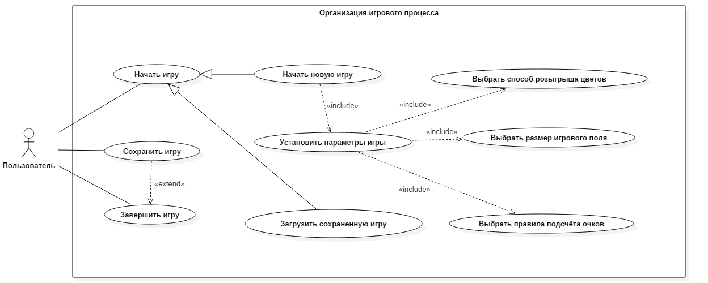

# Go

## Задание
  Разработать приложение для игры Го.

## Правила игры

### Основная часть
  * Го представляет собой доску размера 19х19 пунктов (пересечений прямых линий) и камни двух цветов: чёрные и белые. В Го задействованы 2 игрока, один из которых играет чёрными камнями, а другой - белыми. Распределение игровых цветов между соперниками происходит в соответствии с процедурой __нигири__. Изначально доска пуста. Правом первого хода обладает игрок, которому достались чёрные камни. Далее игроки до завершения игры поочерёдно делают ходы. Засчёт того, что чёрные обладают правом первого хода, белым дается компенсация ввиде __коми__ - определённого нецелого числа очков.
  * Процедура __нигири__ подразумевает следующее: один игрок берет в руку горсть белых камней так, чтобы соперник не видел их количество. Другой берет один или два чёрных камня, тем самым пытаясь угадать соответственно чётность или нечётность количества белых камней. Затем игроки выкладывают камни на доску. Если второй игрок угадал чётность, то он играет чёрными, а в противном случае - белыми.
  * Ход заключается в том, что игрок пассует (пропускает ход) или устанавливает камень своего цвета в любой свободный пункт на доске, если это не противоречит двум правилам:
    1. Устанавливаемый камень должен иметь хотя бы одно __дыхание__. __Дыханием__ называется свободный соседний пункт, соединенный с данным камнем по прямой линии. Тем не менее, ход может быть осуществлен так, что устанавливаемый камень лишает свою группу __дыхания__, но при этом лишает __дыхания__ еще и группу соперника, тем самым __съедая__ её.
    2. Данный ход игрока не повторяет его предыдущий ход.
  * __Съедение__ группы камней (или одного камня) соперника считается осуществлённым, если эта группа камней не имеет
    ни одного __дыхания__, то есть ни один камень группы не имеет __дыханий__. __Съеденные__ камни снимаются с доски и остаются до
    конца игры у "съевшего" их игрока.
  * Цель игроков - к концу игры набрать больше очков, чем соперник. Очко даётся за каждый пункт __захваченной территории__ и, в зависимости от правил, за __съеденный__ или __захваченный__ камень соперника или свой живой камень. Территория считается __захваченной__ игроком, если она полностью огорожена камнями его цвета. __Захваченный__ камень - это камень соперника, который имеет __дыхания__, но при желании игрока может быть __съеден__.
  * Игра завершается в трёх случаях:
    1. Один из игроков сдается.
    2. В ответ на пропуск хода одним игроком следует пропуск хода другим.
    3. Не осталось ходов, способных повлиять на ситуацию на доске.
  * Все разыгрываемые в партии очки - целые. Поэтому, с учётом того, что __коми__ - нецелое число, победитель определяется всегда.

### Особенности японских правил
  1. __Коми__ составляет 6,5 очков.
  2. Способ подсчета очков: размер территории + количество захваченных камней противника, включая __съеденные__ камни + __коми__ (для белых).
  
### Особенности китайских правил
  1. __Коми__ составляет 7,5 очков.
  2. Способ подсчета очков: размер территории + количество своих живых камней (то есть камней, выставленных на доску и не взятых противником) + __коми__ (для белых).

## Концепция
  Готовый продукт является кроссплатформенным и содержит приложение как консольное, так и с графическим интерфесом. Есть искусственный интеллект (ИИ), который обладает простой логикой, а не случайно ходит в свободный пункт. Имеется возможность выбрать правила игры: японские или китайские. Определенный правилами размер игровой доски 19х19 пунктов можно изменить на 13х13 и 7х7. Наличие ИИ позволяет не только играть двоим пользователям друг против друга, но и играть одному пользователю против ИИ. Выбор цвета камней происходит либо по договоренности (в случае игры против ИИ цвет выбирает пользователь), либо в соответствии с реализованной традиционной процедурой __нигири__. Ход событий текущей партии можно сохранить и в дальнейшем - загрузить и продолжить. Пользовательский интерфейс включает справочную систему как по самому интерфейсу, так и по игровому процессу.
  
  Разработка сопровождается модульным и функциональным тестированием на всех этапах.

## Минимально работоспособный продукт
 Кроссплатформеное консольное приложение, позволяющее в соответствии с японскими правилами играть двоим пользователям.
  
## Диаграммы вариантов использования

## Диаграмма последовательностей
Для неё необходимо спроектировать полностью движок
## Диаграмма компонентов

