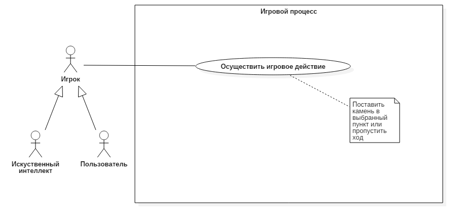
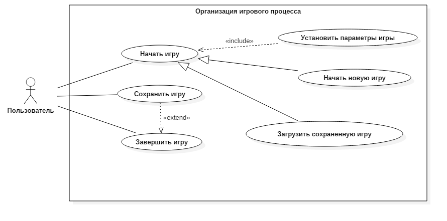
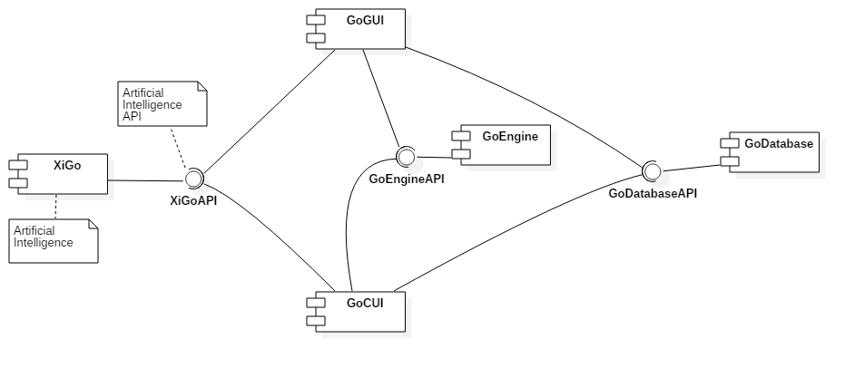

# Go

## Задание
 Разработать приложение для игры Го.

## Концепция ([vision statement](https://en.wikipedia.org/wiki/Vision_statement))
 Готовый продукт является кроссплатформенным и содержит как приложение консольное, так и с графическим интерфесом. Есть искусственный интеллект (ИИ), который обладает простой логикой, а не случайно ходит в свободный пункт. Имеется возможность выбрать [правила игры](https://ru.wikipedia.org/wiki/%D0%92%D0%B0%D1%80%D0%B8%D0%B0%D0%BD%D1%82%D1%8B_%D0%BF%D1%80%D0%B0%D0%B2%D0%B8%D0%BB_%D0%B3%D0%BE): японские или китайские. Есть варианты размеров игровой доски: 19x19, 13x13 и 7x7. Наличие ИИ позволяет не только играть двоим игрокам друг против друга, но и играть одному игроку против ИИ. Выбор цвета камней происходит либо по договоренности (в случае игры против ИИ цвет выбирает игрок), либо случайно, либо в соответствии с традиционной процедурой _нигири_. Ход событий текущей партии можно сохранить и в дальнейшем загрузить и продолжить.

## Минимально работоспособный продукт ([Minimum viable product](https://en.wikipedia.org/wiki/Minimum_viable_product))
 Кроссплатформеное консольное приложение, позволяющее в соответствии с японскими правилами играть двоим игрокам.
 
## Диаграммы прецедентов использования

## Диаграмма последовательностей

## Диаграмма компонентов

